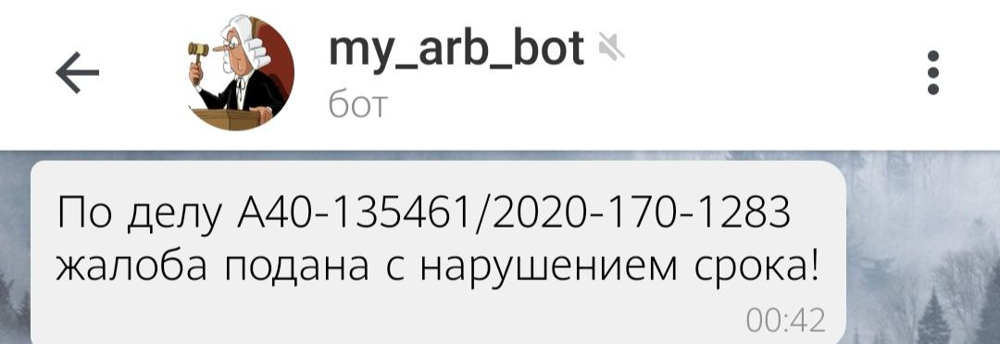

# my_arb_bot
Телеграм-бот для отслеживания результатов рассмотрения арбитражных дел в картотеке https://my.arbitr.ru/#index
 Проект находится в стадии разработки и в настоящее время доступен только для одного пользователя.
 

### Уже реализовано:

:white_check_mark: Добавление дел в базу данных (по одному делу либо списком)
/удаление дел из базы данных 
:white_check_mark: Асинхронное выполнение функций, связанных с отслеживанием дел
 и функций, работающих с базой данных  
:white_check_mark: Вывод номеров дел, которые есть в базе данных, 
с группировкой по стадиям рассмотрения (первая инстанция, апелляция, кассация) 
:white_check_mark: Отслеживание хода рассмотрения дел, список которых был 
передан боту 
:white_check_mark: Оповещение о новых событиях по делу и о новых документах,
 поданных второй стороной со ссылками для их скачивания  
:white_check_mark: Расчет сроков на обжалование решения суда
и оповещение о нарушении этих сроков второй стороной 
:white_check_mark: Прекращение отслеживания дела спустя 2 месяца после вступления
решения в силу 

### Предстоит реализовать:
:black_square_button: Асинхронное отслеживание дел для нескольких пользователей

### Примеры работы:
Передача, отображение списка дел и запуск отслеживания
 

Сообщение о завершении рассмотрения дела
 

 

Сообщение о ходе рассмотрения дела
 

 

Сообщение о нарушении процессуального срока
 

 

Сообщение о новом событии по делу
 

 

### Основные технологии:
Python: requests, bs4, telegram.ext
 PostgreSQL
